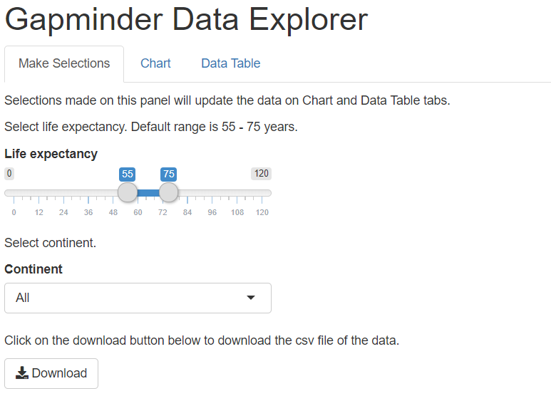
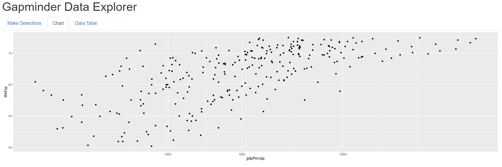
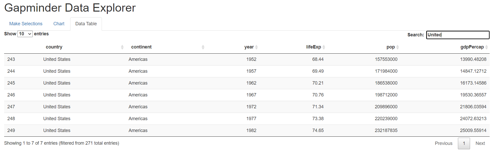

Shiny Application and Reproducible Pitch - Gapminder Explorer
========================================================
author: EK
date: 06/15/2020
autosize: true

App Description
========================================================

This presentation is done as part of the peer-graded assignment for 
the coursera developing data products class. 
The assignment has two parts:

- A Shiny application and deploy it on Rstudio's servers

- Rstudio Presenter to prepare a reproducible presentation

In this assignment, gapminder dataset is used to design the Shiny app. 
The data provides life expectancy, GDP per capita and population data
for each country.

Our app provides various Shiny controls for the user to quickly filter
the gapminder data by visualizing it or in a table.

App Guide
========================================================

- The app is available at: <https://kosaraju.shinyapps.io/Gapminder/>
- The code for UI and Server are available in a single file "app.R" on gihub at:
<https://github.com/ekosaraju/shiny-gapminder-app>
- The UI is organized into three tabs: Make Selections, Chart and Data Table 
  tabs.
- User makes selection on the Make Selection tab.
  - Life expectancy range can be selected on the slider bar.
  - Continent may be selected from the dropdown.
  - Optionally, copy of the data may be downloaded by clicking on the download
  button.
<div align="left">

</div>


App Guide 2
========================================================

- The output of the selections is displayed on the Chart and Data Table tabs.
  


App Guide 3
========================================================



Note: The datatable can be further filtered by country based on the entry 
in the search box as depicted above.

Summary of the Dataset
========================================================


```r
library(ggplot2)
library(dplyr)
df <- as_tibble(read.csv("gapminder_data.csv",header = TRUE))
head(df)
```

```
# A tibble: 6 x 6
  country continent  year lifeExp     pop gdpPercap
  <chr>   <chr>     <int>   <dbl>   <int>     <dbl>
1 Albania Europe     1952    55.2 1282697     1601.
2 Albania Europe     1957    59.3 1476505     1942.
3 Albania Europe     1962    64.8 1728137     2313.
4 Albania Europe     1967    66.2 1984060     2760.
5 Albania Europe     1972    67.7 2263554     3313.
6 Albania Europe     1977    68.9 2509048     3533.
```
Thank you!
========================================================
